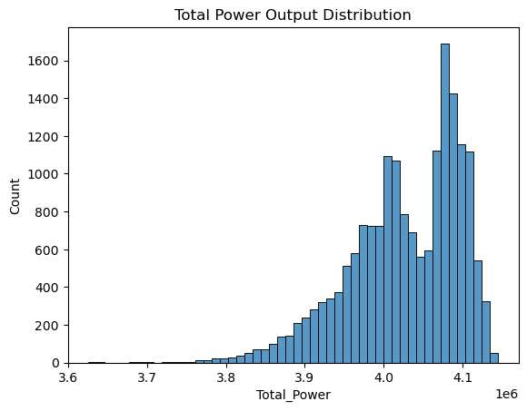
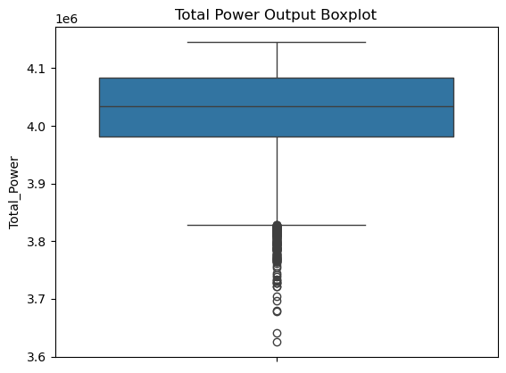
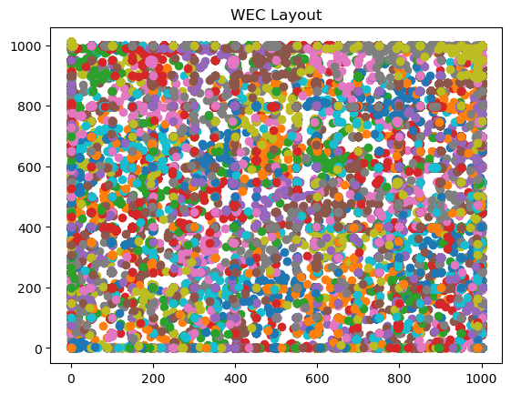

# ML project - Predicting Total Wave Output of a Wave Energy Farm

---

## **Introduction**
Wave energy is a rapidly advancing and promising renewable energy source that holds great potential for addressing the challenges of global warming and climate change. However, optimizing energy output in large wave farms presents a complex problem due to the expensive calculations required to account for hydrodynamic interactions between wave energy converters (WECs).This project employs data preprocessing, feature engineering and regularization to create a model that generalizes well to unseen data. My main goal was to predict the total power output of the wave farm.

## **Dataset**
This [dataset](https://archive.ics.uci.edu/dataset/882/large-scale+wave+energy+farm) which i got from  the UCI repository, was derived from a study published at the GECCO conference. It includes 54,000 and 9,600 configurations involving 49 and 100 WECs, coordination, power, q-factor, and total farm power output. The dataset consists of features representing wave characteristics, distances, and other operational parameters, along with the target variable: **Energy Output (Target)**. For this project, I used the 'WEC_Sydney_49' dataset. Please note that other datasets included in the ['Large-scale Wave Energy Farm'](https://archive.ics.uci.edu/dataset/882/large-scale+wave+energy+farm) data can also be used. 

## **Exploratory Data Analysis (EDA)**
Dataset contains no null or missing values.

Distribution of the total power output

Total Power Output Boxplot

Layout of the Wave Energy Converters (WEC)

